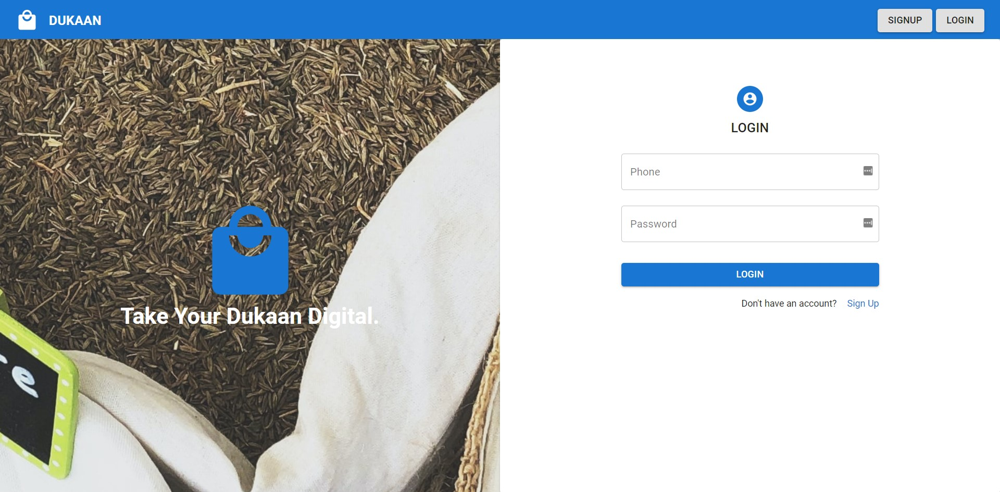
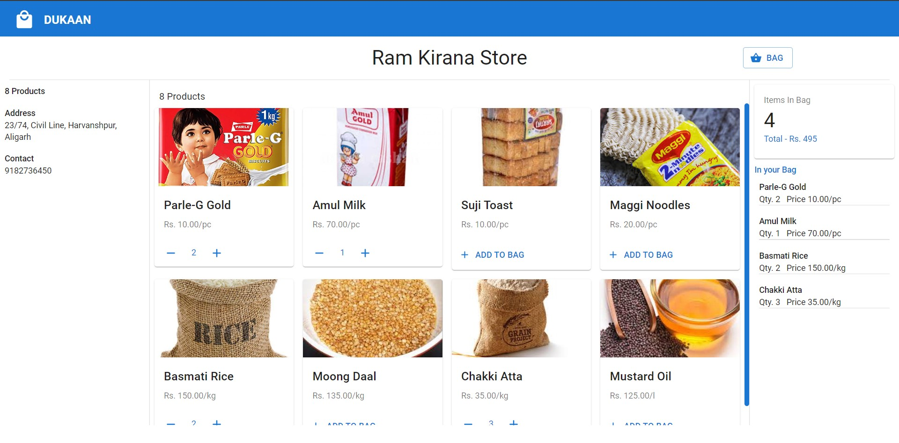
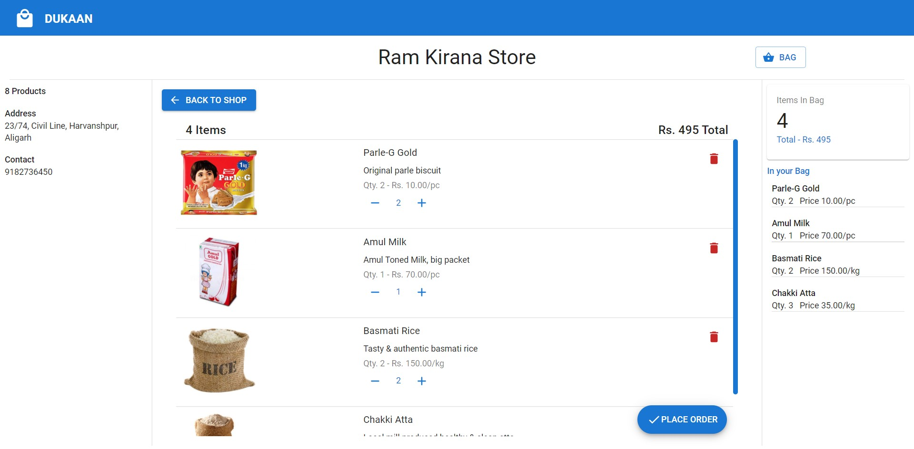
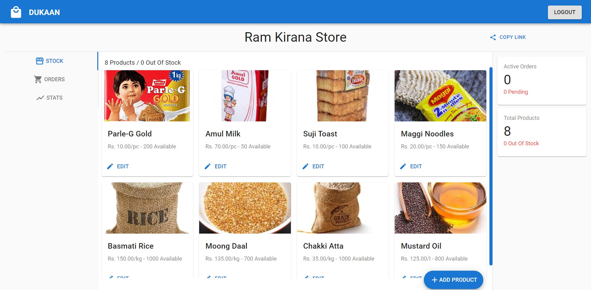
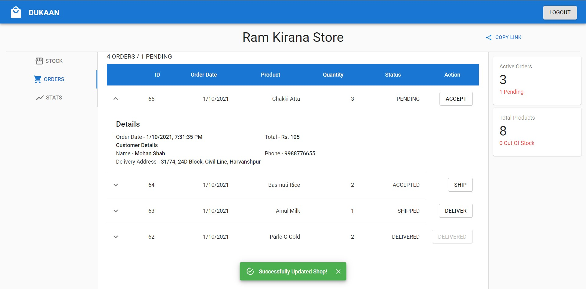

# Dukaan

This is a web app clone of popular Dukaan App, made just for of learning purpose.

Following is list of major tools that were utilized to develop the app:<br>

- **Backend**
  - Django
  - DRF
  - PostgreSQL
  - Postman
- **Frontend**
  - React
  - Redux
  - MaterialUI
  - Formik
  - Axios

App Previews: <br><br>
 <br>
 
<br>
 

## Setup

In root directory create a virtual Python environment for backend, (using `virtualenv`) named "env" here:

```
virtualenv env
```

Activate virtual environment:

- Windows

```
\env\Scripts\activate
```

- Linux/Mac

```
source env/bin/activate
```

Install all backend dependencies from `requirements.txt`:

```
pip install -r requirements.txt
```

Now, install all frontend dependencies listed in `frontend/package.json`, using npm

```
cd frontend
npm install
```

All app dependencies must be installed now.<br>

## **NOTE**

Configure the `backend/dukaan/settings.py` to connect your database to the app before running the app. See:<br>
[How To Use PostgreSQL with your Django Application](https://www.digitalocean.com/community/tutorials/how-to-use-postgresql-with-your-django-application-on-ubuntu-14-04). <br><br>

Now migrate all the tables to your db. In root dir:

```
cd backend
python manage.py makemigrations
python manage.py migrate
```

All required tables should exist in db now.<br>
**NOTE** - Populate the `ProductCategory` table with product categories to be available in shop. Forms to Add/Edit a product in the app fetch available categories from this table. If left empty, relevant fields (drop down menus) won't display any choice to select.

## Run the App

Spin up the django server for API requests. In root dir:

```
cd backend
python manage.py runserver
```

Run the frontend dev server. In root dir:

```
cd frontend
npm run start
```

That's it.<br>
Note that you don't need to run two different server to run app. This was just for development purpose. The django's `backend/dukaan/settings.py` can be configured to serve the static resources from django server itself. See: <br>
[Django React Setup – Best Project Structure](https://studygyaan.com/django/django-react-setup-best-project-structure).

## Developed By

**Naveen Sahu** <br>
Twitter - [@heyNvN](https://twitter.com/heyNvN)

## License

See [LICENSE](https://github.com/theNvN/dukaan-clone/blob/main/LICENSE)
